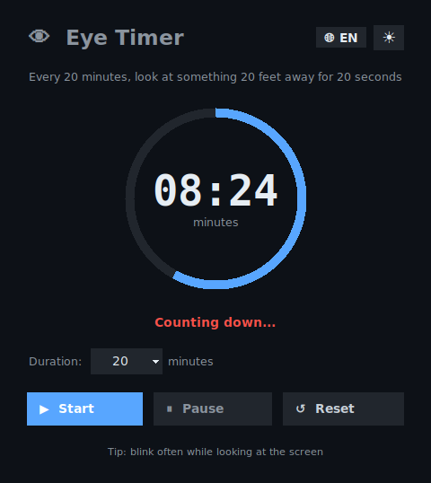

# 👁️ Eye Timer 20-20-20

A small, modern desktop timer for the **20-20-20 rule**: every 20
minutes, look at something 20 feet (6 meters) away for 20 seconds.
Built with Python and Tkinter — no external dependencies, one file,
runs anywhere Python does.

*(Italiano più sotto ⬇️)*

[](https://www.python.org/)
[](#requirements)
[](locales/)





---

## Features

- ⏱ **20-20-20 countdown** with a selectable duration (5–30 minutes)
- 🎨 **Modern UI** — animated progress ring, dark/light theme toggle
- 🌍 **Multi-language**, switchable live from the window — Italian,
  English, Spanish, French, German out of the box, easy to extend
  (see [`locales/README.md`](locales/README.md))
- 🔔 **Robust alert** — layered fallbacks so you never miss a break:
  sound (auto-detects `pw-play`/`paplay`/`aplay`/`mpg123`/`ffplay`),
  a native desktop notification, an in-app dialog, and a window flash
  if audio truly isn't available
- 🖼 **External icon** — `icon.png` ships as a separate file, easy to
  swap without touching the code
- 💾 Remembers your language choice between runs
- 📦 **Zero dependencies** — pure Python standard library (`tkinter`)

## Screenshot

The image above shows the dark theme; a light theme is available via
the toggle in the top-right corner.

## Requirements

- Python 3.8 or later
- Tkinter (usually bundled with Python; on Debian/Ubuntu:
  `sudo apt install python3-tk`)
- Linux (the sound fallback chain targets Linux audio tools; the UI
  itself is plain Tkinter and may run on other platforms, but this is
  untested)
- *Optional*, for audible alerts: one of `pipewire` (`pw-play`),
  `pulseaudio-utils` (`paplay`), `alsa-utils` (`aplay`), `mpg123`, or
  `ffmpeg` (`ffplay`) — most desktop distributions already have at
  least one of these installed

## Installation & usage

```bash
git clone https://github.com/Jake402-bit/eyetimer.git
cd eyetimer
python3 timer_occhi.py
```

No build step, no virtual environment required.

## Project structure

```
.
├── timer_occhi.py       # main application (single file)
├── icon.png              # window/taskbar icon (external, not embedded)
├── docs/
│   └── screenshot.png
└── locales/               # UI translations, one JSON file per language
    ├── README.md          # how to add a new language
    ├── en.json
    ├── it.json
    ├── es.json
    ├── fr.json
    └── de.json
```

## Adding a language

No code changes needed — drop a new `locales/<code>.json` file (copy
`en.json` and translate the values) and it shows up automatically in
the language picker. Partial translations are fine too: any missing
key falls back to English. Full instructions in
[`locales/README.md`](locales/README.md).

## Troubleshooting

**No sound at the end of the timer** — install an audio player:
```bash
sudo apt install pulseaudio-utils   # or: alsa-utils
```
The app tries several players in sequence and logs to the console
which ones failed and why; if none work, it still flashes the window
and shows a desktop notification, so the alert is never silent.

**Wrong/missing taskbar icon** — make sure `icon.png` sits in the same
folder as `timer_occhi.py`. Without it, the app falls back to your
system's default window icon and prints a notice to the console.

## Contributing

Issues and pull requests are welcome — new language files, bug fixes,
and UI polish are all appreciated. See
[`locales/README.md`](locales/README.md) for the translation
workflow.

---
---

# 👁️ Timer Occhi 20-20-20

*(English above ⬆️)*

Un piccolo timer desktop moderno per la **regola del 20-20-20**: ogni
20 minuti, guarda qualcosa a 6 metri (20 piedi) di distanza per 20
secondi. Scritto in Python e Tkinter — nessuna dipendenza esterna, un
solo file, funziona ovunque giri Python.


## Caratteristiche

- ⏱ **Conto alla rovescia 20-20-20** con durata selezionabile (5–30 minuti)
- 🎨 **Interfaccia moderna** — anello di avanzamento animato, tema chiaro/scuro
- 🌍 **Multilingua**, cambiabile al volo dalla finestra — italiano,
  inglese, spagnolo, francese, tedesco già inclusi, facile da estendere
  (vedi [`locales/README.md`](locales/README.md))
- 🔔 **Avviso robusto** — più livelli di fallback per non perdere mai
  una pausa: suono (rileva automaticamente `pw-play`/`paplay`/
  `aplay`/`mpg123`/`ffplay`), notifica desktop nativa, dialogo
  nell'app, e lampeggio della finestra se l'audio non è disponibile
- 🖼 **Icona esterna** — `icon.png` è un file separato, facile da
  sostituire senza toccare il codice
- 💾 Ricorda la lingua scelta tra un avvio e l'altro
- 📦 **Zero dipendenze** — solo libreria standard di Python (`tkinter`)

## Requisiti

- Python 3.8 o successivo
- Tkinter (di solito incluso con Python; su Debian/Ubuntu:
  `sudo apt install python3-tk`)
- Linux (la catena di fallback audio punta agli strumenti audio
  Linux; l'interfaccia è puro Tkinter e potrebbe funzionare anche su
  altre piattaforme, ma non è testato)
- *Facoltativo*, per l'avviso sonoro: uno tra `pipewire` (`pw-play`),
  `pulseaudio-utils` (`paplay`), `alsa-utils` (`aplay`), `mpg123` o
  `ffmpeg` (`ffplay`) — la maggior parte delle distribuzioni desktop
  ne ha già almeno uno installato

## Installazione e utilizzo

```bash
git clone https://github.com/<tuo-utente>/<tuo-repo>.git
cd <tuo-repo>
python3 timer_occhi.py
```

Nessuna build, nessun ambiente virtuale richiesto.

## Struttura del progetto

```
.
├── timer_occhi.py       # applicazione principale (file singolo)
├── icon.png              # icona finestra/barra applicazioni (esterna, non incorporata)
├── docs/
│   └── screenshot.png
└── locales/               # traduzioni dell'interfaccia, un JSON per lingua
    ├── README.md          # come aggiungere una nuova lingua
    ├── en.json
    ├── it.json
    ├── es.json
    ├── fr.json
    └── de.json
```

## Aggiungere una lingua

Non serve toccare il codice: basta aggiungere un file
`locales/<codice>.json` (copia `en.json` e traduci i valori) e
comparirà automaticamente nel selettore. Vanno bene anche traduzioni
parziali: le chiavi mancanti ricadono sull'inglese. Istruzioni
complete in [`locales/README.md`](locales/README.md).

## Risoluzione problemi

**Nessun suono a fine timer** — installa un lettore audio:
```bash
sudo apt install pulseaudio-utils   # oppure: alsa-utils
```
L'app prova diversi lettori in sequenza e stampa in console quali
falliscono e perché; se nessuno funziona, fa comunque lampeggiare la
finestra e mostra una notifica desktop, così l'avviso non passa mai
inosservato.

**Icona sbagliata o mancante in barra applicazioni** — assicurati che
`icon.png` sia nella stessa cartella di `timer_occhi.py`. Senza,
l'app usa l'icona di default del sistema e stampa un avviso in console.

## Contribuire

Segnalazioni e pull request sono benvenute — nuovi file di traduzione,
correzioni di bug e miglioramenti all'interfaccia sono tutti
apprezzati. Vedi [`locales/README.md`](locales/README.md) per il
flusso di lavoro delle traduzioni.
